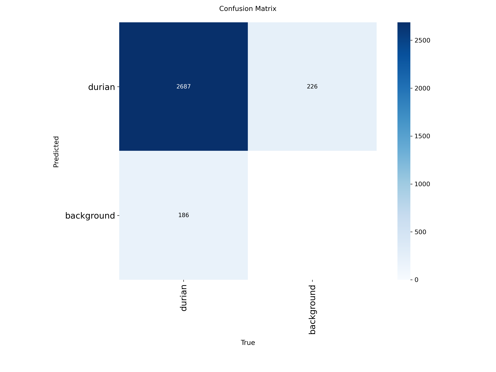

# DurianVision AI

**Live demo:** https://huggingface.co/spaces/nimnxmn/DurianVisionAI

End-to-end durian detection and counting from a single canopy photo. Upload a photo taken from beneath the tree looking up — the app draws bounding boxes around every durian and gives you an exact count.

- **Precision:** 95.7% · **Recall:** 91.6% · **mAP50:** 0.959
- **Inference:** ~527 ms per image on CPU (HF Spaces free tier)
- **Dataset:** 2,800+ annotated durian instances, augmented for canopy occlusion
- **Supports:** JPEG, PNG, HEIC (iPhone photos)

## Domain constraint

Images must be taken from a **nadir-to-canopy perspective** — camera positioned directly below the tree, pointing upward at the fruit canopy. This is the viewpoint the model was trained on. Standard side-on orchard photos will not detect correctly.

## Model evaluation

| Metric | Value |
|---|---|
| Precision | 95.7% |
| Recall | 91.6% |
| mAP50 | 0.959 |
| Inference (CPU) | ~527 ms |

<p align="center">
  
  
</p>
<p align="center">
  
</p>

## Stack

| Layer     | Tech                                                                                                  |
| --------- | ----------------------------------------------------------------------------------------------------- |
| Model     | YOLOv8 (Ultralytics), trained on Roboflow                                                             |
| Backend   | FastAPI, uvicorn, Pillow, OpenCV (headless)                                                           |
| Frontend  | Next.js 16 (App Router, static export), React 19, TypeScript, Tailwind CSS v4, shadcn/ui, next-themes |
| Container | Multi-stage Docker → single image                                                                     |
| Deploy    | Hugging Face Spaces (Docker runtime, port 7860)                                                       |

## Architecture

```
Browser  ──HTTP──▶  FastAPI (port 7860)
                      ├── GET  /              → static Next.js export
                      ├── GET  /api/health    → {model_loaded: true, ...}
                      └── POST /api/detect    → {count, detections[], image_base64, ...}
                            └─ YOLOv8 inference
```

In dev there are two processes (Next dev server on `:3000`, uvicorn on `:8000`). In production a single Docker container serves both the API and the pre-built frontend on port 7860.

## Run locally (dev)

Backend:

```powershell
python -m uvicorn apps.api.main:app --reload --host 127.0.0.1 --port 8000
```

Frontend:

```powershell
cd apps/web
npm install
npm run dev
```

Open <http://localhost:3000>.

## Build and run the production container

```bash
docker build -t durianvision .
docker run --rm -p 7860:7860 durianvision
```

Open <http://localhost:7860>.

## Project layout

```
apps/
  api/                 FastAPI backend
  web/                 Next.js frontend
    app/               App Router pages
    components/        Controls, ResultCard, ThemeToggle, ui/* (shadcn)
    lib/api.ts         Backend contract + fetch helper
evaluation/            Model eval plots (PR curve, F1 curve, confusion matrix)
docs/                  Phase walkthroughs (1–7)
model/best.pt          YOLOv8 weights
demo-image/            Demo image (49 durians)
Dockerfile             Multi-stage build (node → python)
```

See `docs/phase-N-walkthrough.md` for student-friendly explanations of each build phase.

## License

MIT.
