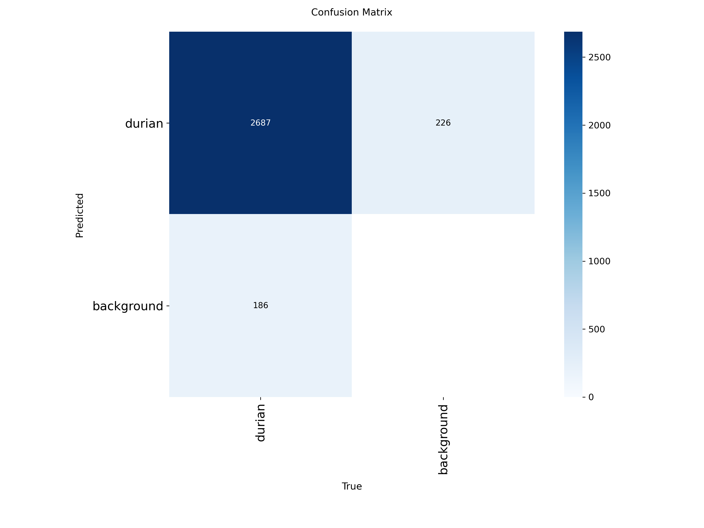

# DurianVision AI

**Live demo:** https://huggingface.co/spaces/nimnxmn/DurianVisionAI


Detect and count durians from under-canopy orchard photos. Upload a photo taken from beneath the tree looking straight up — the model draws a yellow bounding box around every durian and returns an exact count.

- **Precision:** 95.7% · **Recall:** 91.6% · **mAP50:** 0.959
- **Dataset:** 958 hand-labeled boxes across 38 canopy photos, augmented 3× to 114 training images
- **Supports:** JPEG, PNG, HEIC (iPhone photos)

## Domain constraint

Images must be taken from an **under-canopy perspective** — camera positioned directly below the tree, pointing upward at the fruit canopy. This is the viewpoint the model was trained on. Standard side-on orchard photos will not detect correctly.

## How the model was built

The detector was trained end-to-end before a single line of app code was written:

```
[ Capture photos ] ─▶ [ Label in Roboflow ] ─▶ [ Train YOLOv8 (Colab GPU) ] ─▶ [ Evaluate on held-out images ]
```

1. **Data collection.** Photographed durian trees from the ground looking straight up into the canopy, in normal daylight — the hard, realistic case where fruit is partially hidden behind leaves and branches.
2. **Labeling — Roboflow.** Hand-drew a bounding box around every visible durian: **958 boxes across 38 images**, one `durian` class. Exported in YOLOv8 format.
3. **Training — YOLOv8 on Colab.** Augmented 3× per image (114 training images total), fine-tuned from `yolov8n.pt` for **100 epochs at 1024 px** on a free Colab GPU. Best checkpoint saved as `model/best.pt`. Full notebook: [`DurianVisionAI.ipynb`](DurianVisionAI.ipynb).
4. **Evaluation.** Scored on a held-out test set the model never saw during training.

### Dataset & training detail

| Property | Value |
|---|---|
| Raw images | 38 |
| Annotations (bounding boxes) | 958 |
| Classes | 1 (`durian`) |
| Image resolution | 1024 × 1024 |
| Augmentation | 3× per source image |
| Total training images | 114 |

**Augmentations** (3 outputs per source image)
- Rotation: −15° to +15°
- Brightness: −15% to +15%
- Exposure: −10% to +10%
- Blur: up to 2.5 px
- Noise: up to 1.01% of pixels

## Model evaluation

| Metric | Value |
|---|---|
| Precision | 95.7% |
| Recall | 91.6% |
| mAP50 | 0.959 |

<p align="center">
  
  
</p>
<p align="center">
  
</p>

## Stack

| Layer | Tech |
|---|---|
| Model | YOLOv8n (Ultralytics), trained on Roboflow |
| Backend | FastAPI, Pillow, Uvicorn |
| Frontend | Next.js 16 (App Router, static export), React 19, TypeScript, Tailwind CSS v4, shadcn/ui |
| Container | Multi-stage Docker → single image |
| Deploy | Hugging Face Spaces (Docker runtime, port 7860) |

## Architecture

```
Browser  ──HTTP──▶  FastAPI (port 7860)
                      ├── GET  /              → static Next.js export
                      ├── GET  /api/health    → {model_loaded: true, ...}
                      └── POST /api/detect    → {count, detections[], image_base64, ...}
                            └─ YOLOv8 inference + PIL annotation
```

In dev there are two processes (Next dev server on `:3000`, uvicorn on `:8000`). In production a single Docker container serves both the API and the pre-built frontend on port 7860.

## Run locally (dev)

Backend:

```powershell
pip install -r requirements.txt
python -m uvicorn apps.api.main:app --reload --host 127.0.0.1 --port 8000
```

Frontend:

```powershell
cd apps/web
npm install
npm run dev
```

Open <http://localhost:3000>.

## Build and run the production container

```bash
docker build -t durianvision .
docker run --rm -p 7860:7860 durianvision
```

Open <http://localhost:7860>.

## Project layout

```
apps/
  api/                 FastAPI backend
  web/                 Next.js frontend
    app/               App Router pages
    components/        Controls, ResultCard, DropZone, ThemeToggle, ui/* (shadcn)
    lib/api.ts         Backend contract + fetch helper
evaluation/            Model eval plots (PR curve, F1 curve, confusion matrix)
model/best.pt          YOLOv8 weights
demo-image/            Demo image (49 durians)
DurianVisionAI.ipynb   Colab training notebook
Dockerfile             Multi-stage build (node → python)
```

## License

MIT.
